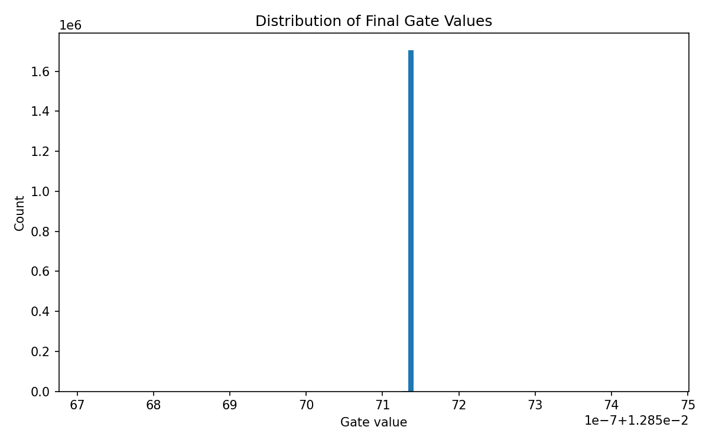

# Self-Pruning Neural Network — Case Study Report

## Why L1 penalty on sigmoid gates encourages sparsity
Each gate is computed as $g = \sigma(s)$, where $g \in (0,1)$ and $s$ is a learnable score.
The sparsity term is:

$$
\mathcal{L}_{sparsity} = \sum_i g_i
$$

Because all $g_i$ are non-negative, minimizing this term drives many gates toward 0.
As gates shrink, effective weights $w_i \cdot g_i$ are suppressed, which behaves like pruning.
The classifier keeps only useful connections under the tradeoff controlled by $\lambda$.

## Results (Quick CIFAR-10 run)

| Lambda | Test Accuracy (%) | Sparsity Level (%) |
|---:|---:|---:|
| 1.0e-02 | 10.00 | 0.00 |
| 5.0e-02 | 10.00 | 100.00 |
| 1.0e-01 | 10.00 | 100.00 |

## Gate value distribution (best model from this quick run)

